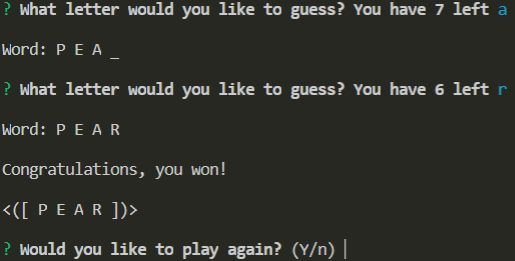
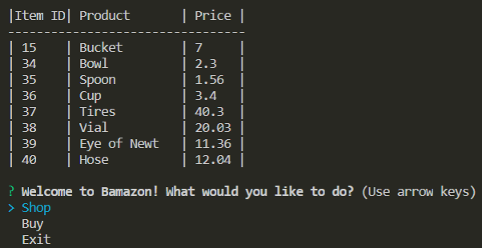
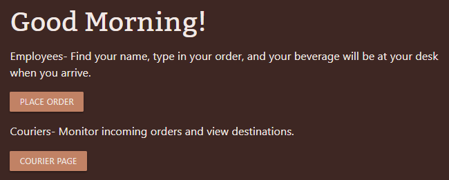

# Web Development Portfolio

[Portfolio](https://defiledspec.herokuapp.com/)

## Projects Completed

* [Hangman](http://defiledspec.github.io/Word-Game-Hangman) - Word Game

* [Crystal Collector](https://defiledspec.github.io/Crystal-Collector) - Numbers Game

* [Trivia](https://defiledspec.github.io/Trivia-Game) - Trivia based game using API calls

* [GifTastic](https://defiledspec.github.io/GifTastic) - Application using GIPHY API

* [Train Scheduler](https://defiledspec.github.io/Train-Scheduler) - Simple application to add new trains and frequency of arrival to station, using Firebase Realtime Database

* [MEH YouTube Player](https://gustbrad.github.io/mehyoutubeplayer) - A simple web app that gives you song lyrics from MusixMatch next to your favorite songs or music videos from YouTube

* [Liri Bot](https://github.com/DefiledSpec/liri-bot) - Like SIRI but...better!

* [Word Guess CLI](https://github.com/DefiledSpec/word-guess-cli) - Hangman game using constructors in node.js and inquirer.js

* [Bamazon](https://github.com/DefiledSpec/bamazon-cli) - Amazon like store front on the command line written in node.js and using mySQL for data storage.

* [Friend Finder](https://defiledspec-friend-finder.herokuapp.com) - Node.js server with front-end client for finding a friend with similar intrests.

* [Eat Da Burger](https://ds-eat-da-burger.herokuapp.com/) - Node.js ORM using handlebars

* [Get Me My Coffee](https://getmemycoffee.herokuapp.com/) - Full Stack Web Application for companies to place coffee orders.

* [OSRS News Scraper](https://osrs-news-scraper.herokuapp.com/) - Full Stack Web Application using cheerio to scrape OSRS news and store it in mongodb.

* [Clicky Game](https://ds-clicky-game.herokuapp.com) - Memory game using React to dynamically render content.

* [NYT React Search](https://github.com/DefiledSpec/nyt-react-search) - A full stack web application that queries the nyt API, users can save their favorite articles to MongoDB

* [Job Track](https://github.com/EGartland/JobTrack) - A full stack web application that queries the nyt API, users can save their favorite articles to MongoDB

## Current Projects
